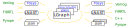

# Introduction

LiveHD is an infrastructure designed for Live Hardware Development. By live, we
mean that small changes in the design should have the synthesis and simulation
results in a few seconds.

As the goal of "seconds," we do not need to perform too fine grain incremental
work. Notice that this is a different goal from having an typical incremental
synthesis, where many edges are added and removed in the order of thousands of
nodes/edges.

## Goal

LiveHD: a fast and friendly hardware development flow that you can trust

* To be "Fast", LiveHD aims to be parallel, scalable, and incremental/live flow.
* To be "friendly", LiveHD aims to build new models to have good error reporting.
* To "trust", LiveHD has CI and many random tests with logic equivalence tests (LEC).

## LiveHD Framework

LiveHD is optimized for synthesis and simulation. The main components of LiveHD
includes LGraph, LNAST, integrated 3rd-party tools, code generation, and "live"
techniques.

A compilation goes through the following steps:

* Source code goes through a lexer/parser to create a parse tree or language specific AST.

* The parse tree or language specific AST is translated to LNAST. LNAST is a
AST-like representation that it is independent of the specific language.
Pyrope, CHISEL, and Verilog translate to LNAST.

* The are several passes on LNAST to infer the correct type and bitsizes. The goal is to
expand tuples, macros at LNAST level, but this code is still not finished.

* The LNAST is a tree-like representation which is translated to Lgraph. In a
way, LNAST is a HIR (High-level IR) and Lgraph is a LIR (Low-level IR). For
each Lgraph node, there is an equivalent LNAST, but not the opposite.

* LGraph has a hierarchical graph representation designed for fast synthesis
and simulation. It interfaces other tools like Yosys, ABC, OpenTimer, and
Mockturtle.

* For code generation, it is possible to translate back to LNAST or to directly
output from Lgraph.

