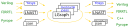

# Introduction

LiveHD is an infrastructure designed for Live Hardware Development. By live, we
mean that small changes in the design should have the synthesis and simulation
results in a few seconds.

As the goal of "seconds," we do not need to perform too fine grain incremental
work. Notice that this is a different goal from having an typical incremental
synthesis, where many edges are added and removed in the order of thousands of
nodes/edges.

## Goal

LiveHD: a fast and friendly hardware development flow that you can trust

* To be "Fast", LiveHD aims to be parallel, scalable, and incremental/live flow.
* To be "friendly", LiveHD aims to build new models to have good error reporting.
* To "trust", LiveHD has CI and many random tests with logic equivalence tests (LEC).

## LiveHD Framework

LiveHD is optimized for synthesis and simulation. The main components of LiveHD
includes LGraph, LNAST, integrated 3rd-party tools, code generation, and "live"
techniques. Both IRs are stored in HHDS (Hierarchical Hardware Data
Structures): LNAST rides on `hhds::Tree`/`hhds::Forest` and LGraph rides on
`hhds::Graph`. Everything is driven by a single command line binary called
[`lhd`](02-usage.md) (the legacy `lgshell` REPL was removed).

A compilation goes through the following steps:

* Source code goes through a lexer/parser to create a parse tree or language
  specific AST. Pyrope uses the `inou/prp` front-end (prp2lnast), and
  SystemVerilog can use the slang-based `inou/slang` front-end.

* The parse tree or language specific AST is translated to LNAST. LNAST is a
  AST-like representation that it is independent of the specific language.
  Pyrope and SystemVerilog (slang reader) translate to LNAST. Verilog can
  also enter through Yosys (`inou/yosys`), in which case it is translated
  directly to LGraph. CHISEL/FIRRTL was supported in the past, but the code
  is deprecated.

* There are several passes on LNAST (called "upasses", in `upass/`) to build
  the SSA, infer the correct types and bitsizes, and perform tree-level
  optimizations like constant propagation.

* The LNAST is a tree-like representation which is translated to LGraph by
  the `upass/tolg` lowering. In a way, LNAST is a HIR (High-level IR) and
  LGraph is a LIR (Low-level IR). For each LGraph node, there is an
  equivalent LNAST, but not the opposite.

* LGraph has a hierarchical graph representation designed for fast synthesis
  and simulation. Graph-level passes like `pass.cprop` and `pass.bitwidth`
  optimize it, and it interfaces other tools like Yosys.

* For code generation, `inou.cgen.verilog` emits Verilog from LGraph, and
  `pass.prp_writer` can re-emit Pyrope from LNAST.

