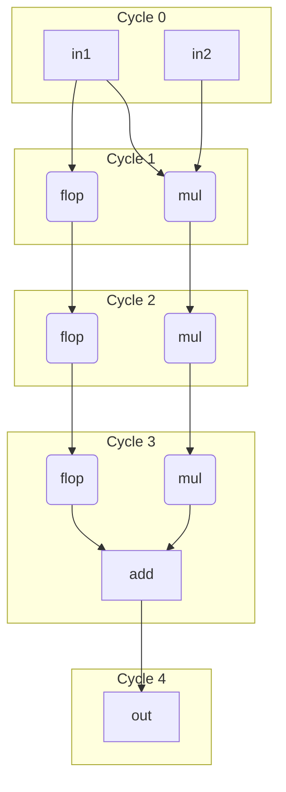

# Pipelining

## Registers and State

In hardware, registers (built from flip-flops) are essential for storing information and creating pipeline stages. Our language provides a clear and safe syntax for managing these stateful elements.

While it's possible to instantiate low-level flops, the recommended, programmer-friendly method is to declare a **register** using the `reg` keyword. This makes statefulness explicit and prevents common bugs. The compiler guarantees that a `reg` is a state-holding element.

A register's value at the start of a cycle is its **current state**. New
values are assigned with plain `=` (e.g., `counter = counter + 1`). The
`.[defer]` construct is **RHS-only**: it reads the end-of-cycle value
(after all in-cycle writes have accumulated), which is useful inside
loops and for assertions. There is no `total.[defer] = ...` LHS form.
`.[defer]` is a same-cycle *wiring* construct — no flop is involved and no
cycle boundary is crossed (see
[defer is wiring, not time](05b-statements.md#defer-is-wiring-not-time)).

In our syntax, a bare reference to `total` reads the register's current
state. `total.[defer]` on the RHS reads what the register *will* be at
end of cycle. If you need to snapshot the current value before later
code modifies the register within the cycle, copy it into a local:
`const counter_q = counter`.

=== "Structural flop style"
    ```pyrope
    mut counter_next:u8 = nil

    const counter_q = __flop(din=counter_next.[defer]  // RHS read of final update
                       ,reset_pin=ref my_rst, clock_pin=ref my_clk
                       ,enable=my_enable            // enable control
                       ,posclk=true
                       ,initial=3                   // reset value
                       ,sync=true)

    wrap counter_next = counter_q + 1
    ```

=== "Pyrope style"
    ```pyrope
    reg counter:u8:[reset_pin=ref my_rst, clock_pin=ref my_clk, posclk=true] = 3
    const tmp1 = counter             // snapshot q before any updates this cycle

    if my_enable {
      wrap counter = counter + 1
      assert(tmp1 != counter.[defer]) // compare against the in-cycle accumulated value
    }
    ```


!!! NOTE
    Attributes ending in `_pin` (like `clock_pin`, `reset_pin`) connect wires,
    not values. Use `ref` to indicate a wire connection (e.g., `clock_pin=ref my_clk`).
    The compiler warns if a `_pin` attribute is used without `ref` and without
    a `comptime` value. Passing a `comptime` value like `0` or `false` is valid
    without `ref` (it ties the pin to a constant).

## Retiming

Registers declared with `reg` are preserved by default, meaning synthesis tools cannot move or optimize them away. This ensures that intentional state is maintained.

If a register is intended to be a flexible pipeline stage rather than a fixed state-holding element, it can be marked with the `retime` attribute. This allows synthesis tools to perform optimizations like moving logic across the register, duplication, or elimination to improve performance.

```pyrope
reg my_reg::[retime=true, clock_pin=ref my_clk, init=0]
```


## Pipelined Lambdas (`pipe`)

A `pipe` lambda is a fixed-latency pipeline with at least one stage. The
number of pipeline stages is written as an argument to the `pipe` keyword, in
the same `[N]` position used by `stage[N]`; `N` must be positive. A zero-cycle
block is `comb`, not `pipe[0]`.

```pyrope
pipe mul(a:u16, b:u16) -> (c:u32)         { c = a * b } // bare: caller picks at call site
pipe[5]     mul(a:u16, b:u16) -> (c:u32)  { c = a * b } // fixed 5-cycle latency
pipe[1..<4] mul(a:u16, b:u16) -> (c:u32)  { c = a * b } // flexible range; caller/compiler picks
```

The three forms behave as follows:

* **Bare `pipe foo(...)`** — latency is unspecified at declaration. The caller
  must pick a concrete positive number of cycles at the call site using
  `stage[N]`.
* **`pipe[N] foo(...)`** — fixed latency. Every call produces its result
  exactly `N` cycles later (`N > 0`), and the caller's `stage[M]` must satisfy
  `M == N`.
* **`pipe[A..<B] foo(...)`** — flexible range. The caller picks a `stage[M]`
  with `A <= M < B` and `M > 0`, and the compiler/synthesizer places stages
  accordingly.

### The `pipe` contract

A `pipe` makes two promises — one behavioral, one structural:

* **Latency (behavioral):** every output at cycle `t` is a function of the
  inputs at cycle `t-N`, plus register state that summarizes strictly older
  cycles: `out[t] = f(in[t-N], state)`. All outputs land at the same
  latency `N >= 1`.

* **No feedthrough (structural):** there is never a combinational path from
  an input to an output — every input-to-output path crosses at least one
  flop.

The *reference model* for simulation, verification, and logic equivalence
checking (LEC) is the body evaluated as combinational dataflow at input
time, with `N` flops appended at each output. This is a statement about
behavior, **not** about flop placement: the synthesis tool may place the
actual flops anywhere that preserves the contract — distributed through the
logic by retiming, at the inputs (an SRAM macro with registered inputs is a
valid `pipe[1]`), or at the outputs. Pipeline flops inserted by the
compiler are `retime=true`; state registers (next section) are preserved.
Compiler-inserted flops also inherit the `.[valid]` of the value they
transport: on cycles where the value is invalid the flop need not be
clocked, enabling automatic clock gating as bubbles travel through the
pipeline (see [Fluid blocks](06d-fluid.md#relation-to-optional-valid)).

!!! Observation
    Because no input-to-output combinational path exists, any feedback loop
    closed through a `pipe` is sequential by construction. A `mod` can
    instantiate `pipe`s in feedback topologies without creating
    combinational loops, and loop checking stays modular.

### Registers inside a `pipe`: state vs stage

A `pipe` body may declare `reg` variables. The compiler classifies every
register into one of two roles from the dataflow graph alone — the role is
never annotated:

* **State register** — participates in feedback: its next value depends,
  directly or transitively, on its own current value. Accumulators,
  counters, valid bits, FSM state. A state register is *pinned* to a home
  stage and adds no pipeline latency. Reading it returns the current state
  (`q`), exactly like `reg` everywhere else in Pyrope.

* **Stage register** — pure feedforward transport: its next value is a
  function of inputs and earlier stages only. It is an explicit pipeline
  stage and counts toward the declared latency `N`.

Two rules fall out of the classification:

* **An incomplete write is feedback.** `if en { tmp = a }` means `tmp`
  holds its value when `en` is false — an implicit `tmp = tmp` on the
  untaken path. Holding is self-dependence, so a conditionally written
  register is always a state register. Equivalently: a stage register must
  be written unconditionally.

* **A `reg` output must be state.** `pipe[1] counter(en) -> (reg count)` is
  the counter idiom: the state register itself is the output (its home
  stage must be `N-1`, which is stage 0 in a `pipe[1]`). A *feedforward*
  `reg` in the output list is rejected: outputs are already registered by
  the contract, so it would either duplicate the output flop or silently
  add one extra cycle to a single output.

### Accepting and rejecting `pipe` bodies

Legality of a `pipe` body is decided by one compiler pass, **stage
inference**. Every value is tagged with a stage number `σ`: a value with
stage `σ` computed at cycle `t` derives from the inputs of cycle `t-σ`.

1. **Build the dataflow graph.** One node per operation. Each register `r`
   contributes a sequential edge from its write side `r.d` (next value) to
   its read side `r.q` (current value). Incomplete writes are completed
   first with the implicit hold (`r.d = r.q` on untaken paths).

2. **Classify registers (strongly connected components).** Run an SCC pass
   (Tarjan) over the graph, sequential edges included:
     * an SCC containing only combinational edges is a combinational loop —
       rejected, as everywhere in Pyrope;
     * a register whose `d -> q` edge lies inside an SCC is a **state**
       register;
     * every other register is a **stage** register.

3. **Solve the stage constraints.** Propagate `σ` over the graph:
     * input: `σ = 0`; constants and `comptime` values carry no stage
       (they unify with any stage)
     * combinational op: all operands must have **equal** `σ`; the result
       inherits it
     * stage register: `σ(q) = σ(d) + 1`
     * state register: `σ(q) = σ(d)` — pinned at its home stage
     * `past[n](x)`: `σ = σ(x) + n`
     * `x.[defer]`: same-cycle wiring to the end-of-cycle value — never a
       stage shift: `σ = σ(x.d)`
     * plain output: `σ <= N`; the compiler appends the missing `N - σ`
       flops at that output
     * `reg` (state) output: home stage must equal `N - 1`; the register
       `q` itself is the output, with no appended flop

The rules in step 3 form a system of difference constraints solved with an
offset (weighted) union-find in near-linear time; a conflict is reported at
the operation that introduced it, naming both stages.

!!! NOTE
    The compiler pads **only at outputs**, never internally. Output padding
    is always safe — outputs feed nothing else inside the pipe, so adding
    flops there cannot change relative alignment. An internal stage
    mismatch, in contrast, has two plausible meanings (delay the early
    operand, or the writer made an off-by-one mistake), and silently
    picking one is precisely the bug class `pipe` exists to eliminate. Use
    `past[n](x)` or an explicit stage register to state which alignment was
    intended.

For `pipe[A..=B]`, the body must support the **entire** declared range:
its intrinsic depth `max σ(output)` must be `<= A`, or the declaration
is rejected — the declaration is an interface, and a caller may rely on
any latency in `[A, B]` without knowing the body. For bare `pipe`, the
body fixes a *minimum* latency `max σ(output)`: the caller's `stage[M]`
(or the latency the tool picks) must be at least that minimum. In both
cases output padding fills the difference.

!!! NOTE
    For a range (`pipe[A..=B]`) or a bare `pipe`, the **tool** owns the
    depth choice within the legal range. Synthesis may pick any value to
    meet timing, and simulation may re-roll the choice per seed: a caller
    that bakes in an unwarranted latency assumption then fails fast under
    randomized legal latencies instead of working by accident at one
    depth. Code that respects the `stage[N]`/`@[N]` checks is unaffected
    by the choice.

A body accepted by stage inference is retiming-equivalent to the canonical
spelling of the same function — a combinational body with `N` appended
output flops. Different legal spellings of the same `pipe` therefore pass
LEC against each other by construction.

The diagnostics name the offending nodes and stages:

* `stage mismatch: 'tmp' is at stage 1, 'a' at stage 0` — cross-stage
  operand mix
* `output 'x' lands at stage 2, pipe declares 1` — latency exceeded
* `feedforward register 'x' in output list` — stage register as output
* `combinational loop through 'v'`

#### Accepted examples

=== "Comb body (canonical)"
    ```pyrope
    pipe[3] mul(a:u16, b:u16) -> (c:u32) {
      c = a * b           // σ=0; the compiler appends the 3 stage flops
    }
    // c[t] == a[t-3] * b[t-3]
    ```

=== "State register"
    ```pyrope
    pipe[1] acc_mix(a:u32, b:u32) -> (x:u32) {
      reg tmp:u32 = 0
      wrap tmp += a + b   // reads its own q → state register, home stage 0
      wrap x = tmp + a    // state q ⊕ input: both σ=0 — legal
    }
    // x[t] == tmp[t-1] + a[t-1]
    ```

=== "Explicit stage register"
    ```pyrope
    pipe[1] split(a:u32, b:u32) -> (x:u32, y:u32) {
      reg tmp:u32 = 0
      wrap tmp = a + b    // unconditional, feedforward → stage register
      x = tmp             // σ=1 == N: the explicit reg is the pipeline flop
      wrap y = tmp + 1    // σ=1 == N
    }
    // LEC-equivalent to:
    // pipe[1] split(a:u32, b:u32) -> (x:u32, y:u32) {
    //   wrap x = a + b ; wrap y = x + 1
    // }
    ```

=== "State output (counter idiom)"
    ```pyrope
    pipe[1] counter(enable:bool) -> (reg count:u8) {
      if enable { wrap count += 1 }  // conditional write → state; q is the output
    }
    // count[t] == count[t-1] + enable[t-1]
    ```

=== "State at an internal stage"
    ```pyrope
    pipe[2] mac(a:u16, b:u16) -> (acc:u32) {
      reg prod:u32 = 0
      wrap prod = a * b   // stage register: prod.q at σ=1
      reg sum:u32 = 0
      wrap sum += prod    // state register, home stage 1 (anchored by prod.q)
      acc = sum           // σ=1; the compiler pads 1 flop → lands at N=2
    }
    ```

#### Rejected examples

=== "Cross-stage mix"
    ```pyrope
    pipe[1] bad_mix(a:u32, b:u32) -> (x:u32) {
      reg tmp:u32 = 0
      wrap tmp = a + b    // feedforward → stage register: tmp.q at σ=1
      wrap x = tmp + a    // ERROR: 'tmp' is at stage 1, 'a' at stage 0
    }
    ```

    Note the one-character distance to the accepted `acc_mix`: with `+=`,
    `tmp` is state and mixing it with `a` is coherent (current state plus
    current input). With `=`, `tmp` is a one-stage delay, and `tmp + a`
    adds yesterday's `a + b` to today's `a` — almost always an off-by-one
    bug. If the mix is intended, align it explicitly:

    ```pyrope
      wrap x = tmp + past[1](a)   // both at stage 1 — accepted
    ```

=== "Feedforward reg output"
    ```pyrope
    pipe bad_out(a:u32, b:u32) -> (reg x:u32, reg y:u32) {
      wrap y = x + 1      // reads x.q at σ=1 → y would land at σ=2, x at σ=1
      wrap x = a + b      // ERROR: feedforward register 'x' in output list
    }
    ```

    The outputs are already registered by the `pipe` contract. The intended
    function is spelled without output registers:

    ```pyrope
    pipe[1] good(a:u32, b:u32) -> (x:u32, y:u32) {
      wrap x = a + b
      wrap y = x + 1      // x is the stage-0 comb value; both land at cycle 1
    }
    ```

=== "Latency exceeded"
    ```pyrope
    pipe[1] too_deep(a:u32) -> (x:u32) {
      reg s1:u32 = 0
      reg s2:u32 = 0
      wrap s1 = a + 1     // stage register: σ=1
      wrap s2 = s1 + 1    // stage register: σ=2
      x = s2              // ERROR: output 'x' lands at stage 2, pipe declares 1
    }
    // legal as pipe[2] (or as bare pipe called with stage[M], M >= 2)
    ```

#### References

The stage-inference pass combines three standard algorithms:

* R. E. Tarjan, *Depth-First Search and Linear Graph Algorithms*, SIAM
  Journal on Computing 1(2), 1972 — the SCC pass used to classify state vs
  stage registers (step 2).
* T. H. Cormen, C. E. Leiserson, R. L. Rivest, C. Stein, *Introduction to
  Algorithms* — systems of difference constraints (single-source shortest
  paths chapter); the `σ` constraint solving in step 3.
* C. E. Leiserson, J. B. Saxe, *Retiming Synchronous Circuitry*,
  Algorithmica 6(1), 1991 — stage inference accepts exactly the bodies that
  are retiming-equivalent to the canonical comb-plus-output-flops form, and
  the same framework licenses the tool-side freedom in flop placement.


## Multiply-Add Example

Let's re-examine the example of integrating a 3-cycle multiplier with a 1-cycle adder. The main challenge in most HDLs is that the syntax is not aware of timing, forcing the programmer to manually track and align signals from different pipeline stages. This is error-prone.

Our syntax solves this with **explicit timing annotations**, making such errors impossible to ignore.


`mod` blocks allow arbitrary mixing of variable clock cycles. Where `pipe`
declares one uniform latency for all outputs (`N >= 1`, no feedthrough),
a `mod` declares a **landing cycle per output** at its interface, and any
cycle from 0 up is legal — `mod f(a:u8) -> (x:u8@[2], y:u8@[0])` has one
output two cycles after the inputs and one combinational feedthrough.
Registered outputs declare the cycle their q lands at
(`reg count:u8@[0]`). The opt-out `@[]` keeps the timing slot but sets min
and/or max to `nil` (unconstrained) — the form foreign Verilog modules,
which carry no markings, ingest as. Omitting `@[...]` on a `mod` output
entirely is a compile error: the interface is the timing contract callers
rely on. Inside the body, `mod` blocks have two complementary timing
mechanisms for strong compile-time checking:

* **`stage[N]`** on a declaration: a declaration modifier (in the same slot as
  `const`, `mut`, `reg`) that pipelines the whole RHS over `N` cycles. It is
  the *action* that inserts or chooses pipeline stages.
  `stage[N] lhs = rhs` reads as "`lhs` is `rhs` delivered `N` cycles later".
  `N` must be positive; use a plain assignment for same-cycle delivery.

* **`foo@[N]`** on a variable use: a pure **type check** asserting that `foo`
  lands at cycle `N`. It never inserts flops; a mismatch is a compile error.
  Works identically on LHS declarations (`lhs@[N] = ...`) and on RHS uses
  (`... = add(a=a@[3], b=b@[3])`).

`foo@[N]` never inserts flops — it is *only* an alignment assertion. To
trigger delay flop insertion use an explicit `stage[N]` declaration. To
read a value at a different cycle, use `past[N](x)` or `next[N](x)`.

* Bare `counter` reads the current 'q' value; snapshot with a local
  (`const counter_q = counter`) if you need to capture it before later
  in-cycle updates.
* `past[n](counter)` reads the value `n` cycles ago. The compiler inserts
  the flops (see [Temporal library](09-verification.md#temporal-library)).
* `counter.[defer]` is **RHS-only** — it reads the end-of-cycle value.
* `stage[N]` picks how many pipeline stages the RHS `pipe` call inserts
  (`mod` only). A `pipe` may accept a single fixed count or a range; the
  caller picks within it with `stage[N]`. `N` must be positive; `stage[0]` is
  a compile error and should be written as a plain assignment. `stage[A..=B]`
  accepts any positive count in the range, and `stage[]` lets the toolchain
  pick a default.
* `@[N]` is a pure cycle-count typecheck — it asserts that the value is
  produced at (LHS) or read at (RHS) absolute cycle `N`, counted from the
  enclosing `mod`/`pipe` inputs. `@[]` opts out of that check.
* `next`, `eventually`, `rose`, … (debug only) cover future-peek and
  window-quantified sampling.

`stage[N]` is only valid inside `mod` blocks. It is not allowed in `comb`
(pure combinational) or `pipe` (fixed-latency pipeline). `@[N]`, being a
pure check that never changes the hardware, is legal inside both `mod`
and `pipe` bodies (in a `pipe` it asserts the value's inferred stage σ);
it is rejected in `comb`, where every value is by definition at cycle 0.
Inside a `mod`, register state is read via bare variable references
(current value) or `.[defer]` (end-of-cycle value), and prior-cycle
values via `past[n](x)`.

`mod` blocks naturally use `reg` for persistent state across cycles. A
single `mod` can both orchestrate pipeline stages with explicit timing and
maintain stateful elements like accumulators or counters.


```pyrope
// Define primitive components with 'pipe'.
pipe mul(a:u16, b:u16) -> (c:u32) { c = a * b }   // bare; caller picks latency via stage
pipe add(a:u32, b:u32) -> (c:u32) { wrap c = a + b } // bare; caller picks latency via stage

// Define the composite mod that orchestrates the primitives.
mod multiply_add(in1:u16, in2:u16) -> (out:u32@[4]) {
    // Stage 1: run mul over 3 cycles. tmp lands at cycle 3.
    stage[3] tmp = mul(a=in1, b=in2)

    // Stage 2: to add 'in1' to the result we must align it with 'tmp'.
    // Insert 3 flops of pure delay.
    stage[3] in1_d = in1

    // Stage 3: both inputs to 'add' are aligned at cycle 3.
    // The adder takes 1 cycle, so the final output is at cycle 4.
    stage[1] out@[4] = add(a=tmp@[3], b=in1_d@[3])
}
```

The two mechanisms catch different classes of bugs:

* `stage[N]` makes the pipelining contract explicit at every declaration
  site. The number `N` is the **latency of the RHS call**, not an absolute
  cycle.
* `@[N]` on uses and on declarations catches alignment mismatches at compile
  time — both "the input I'm using isn't at the cycle I expected" and "the
  output doesn't land at the cycle I promised". The number `N` is the
  **absolute cycle** counted from the enclosing module/pipe inputs.

Use the empty forms (`stage[]`, `x@[]`) when you deliberately want to skip
one of those checks — for instance during exploration, or when the cycle
budget is determined elsewhere and you don't want the local check to
constrain it. On a `mod` output declaration, `@[]` keeps the timing slot
with min and/or max set to `nil` — the contract exists but is
unconstrained, which is also how imported Verilog modules (no markings)
present their outputs.

```pyrope
mod example(in1:u16, in2:u16, in3:u32) -> (out:u33@[5]) {
    stage[3] res1 = mul(a=in1, b=in2)

    // in3 arrives at cycle 0; we need it at cycle 3 to mix with res1.
    // Introduce an explicit stage binding — no implicit alignment.
    stage[3] in3_d = in3

    stage[2] res2a@[5] = res1@[3] + in3_d@[3]

    out = res2a          // res2a is at cycle 5; out lands at the declared @[5]

    // error: res1 is at cycle 3, not 2
    // stage[2] bad@[5] = res1@[2] + in3_d@[3]

    // error: computed cycle is 5, not 4
    // stage[2] bad2@[4] = res1@[3] + in3_d@[3]
}
```

This syntax makes the required pipelining obvious and enforces it at compile
time, preventing bugs caused by mixing values from different cycles.

## Analogy: `pipe` and `stage` vs. software `async`/`await`

Readers familiar with software `async`/`await` will find the model similar:
`pipe` declares a lambda whose result arrives later (like an `async fn`
returning a future), and `stage[N]` at the call site consumes that future
after a specified number of cycles. The key difference is that Pyrope's
`stage[N]` is a **static, structural** specification — `N` is part of the
hardware contract and must be known at elaboration time — whereas software
`await` is dynamic suspension with runtime-determined latency. Also, `@[N]`
has no software counterpart; it is a hardware-specific type check for
multi-input cycle alignment.


