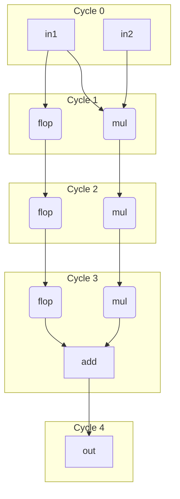

# Pipelining

## Registers and State

In hardware, registers (built from flip-flops) are essential for storing information and creating pipeline stages. Our language provides a clear and safe syntax for managing these stateful elements.

While it's possible to instantiate low-level flops, the recommended, programmer-friendly method is to declare a **register** using the `reg` keyword. This makes statefulness explicit and prevents common bugs. The compiler guarantees that a `reg` is a state-holding element.

A register's value at the start of a cycle is its **current state**. New
values are assigned with plain `=` (e.g., `counter = counter + 1`). The
`.[defer]` construct is **RHS-only**: it reads the end-of-cycle value
(after all in-cycle writes have accumulated), which is useful inside
loops and for assertions. There is no `total.[defer] = ...` LHS form.

In our syntax, a bare reference to `total` reads the register's current
state. `total.[defer]` on the RHS reads what the register *will* be at
end of cycle. If you need to snapshot the current value before later
code modifies the register within the cycle, copy it into a local:
`const counter_q = counter`.

=== "Structural flop style"
    ```
    mut counter_next:u8 = ?

    const counter_q = __flop(din=counter_next.[defer]  // RHS read of final update
                       ,reset_pin=ref my_rst, clock_pin=ref my_clk
                       ,enable=my_enable            // enable control
                       ,posclk=true
                       ,initial=3                   // reset value
                       ,sync=true)

    wrap counter_next = counter_q + 1
    ```

=== "Pyrope style"
    ```
    reg counter:u8:[reset_pin=ref my_rst, clock_pin=ref my_clk, posclk=true] = 3
    const tmp1 = counter             // snapshot q before any updates this cycle

    if my_enable {
      wrap counter = counter + 1
      assert(tmp1 != counter.[defer]) // compare against the in-cycle accumulated value
    }
    ```


!!! NOTE
    Attributes ending in `_pin` (like `clock_pin`, `reset_pin`) connect wires,
    not values. Use `ref` to indicate a wire connection (e.g., `clock_pin=ref my_clk`).
    The compiler warns if a `_pin` attribute is used without `ref` and without
    a `comptime` value. Passing a `comptime` value like `0` or `false` is valid
    without `ref` (it ties the pin to a constant).

## Retiming

Registers declared with `reg` are preserved by default, meaning synthesis tools cannot move or optimize them away. This ensures that intentional state is maintained.

If a register is intended to be a flexible pipeline stage rather than a fixed state-holding element, it can be marked with the `retime` attribute. This allows synthesis tools to perform optimizations like moving logic across the register, duplication, or elimination to improve performance.

```
reg my_reg::[retime=true, clock=my_clk, init=0]
```


## Pipelined Lambdas (`pipe`)

A `pipe` lambda is a Moore machine — outputs always go through flops. The
number of pipeline stages is written as an argument to the `pipe` keyword,
in the same `[N]` position used by `stage[N]`:

```
pipe mul(a, b) -> (c)          { c = a * b }   // bare: caller picks at call site
pipe[5]      mul(a, b) -> (c)  { c = a * b }   // fixed 5-cycle latency
pipe[1..<4]  mul(a, b) -> (c)  { c = a * b }   // flexible range; caller/compiler picks
```

The three forms behave as follows:

* **Bare `pipe foo(...)`** — latency is unspecified at declaration. The caller
  must pick a concrete number of cycles at the call site using `stage[N]`.
* **`pipe[N] foo(...)`** — fixed latency. Every call produces its result
  exactly `N` cycles later, and the caller's `stage[M]` must satisfy `M == N`.
* **`pipe[A..<B] foo(...)`** — flexible range. The caller picks a `stage[M]`
  with `A <= M < B`, and the compiler/synthesizer places stages accordingly.

The tool may retime logic across pipeline stages for performance, but the
observable behavior is equivalent to a `comb` with `N` flops appended at the
outputs. `pipe` can use `reg` for internal storage; besides storage, it
behaves like a `comb` with pipelined outputs.


## Multiply-Add Example

Let's re-examine the example of integrating a 3-cycle multiplier with a 1-cycle adder. The main challenge in most HDLs is that the syntax is not aware of timing, forcing the programmer to manually track and align signals from different pipeline stages. This is error-prone.

Our syntax solves this with **explicit timing annotations**, making such errors impossible to ignore.


`mod` blocks allow arbitrary mixing of variable clock cycles. They have two
complementary timing mechanisms for strong compile-time checking:

* **`stage[N]`** on a declaration: a declaration modifier (in the same slot as
  `const`, `mut`, `reg`) that pipelines the whole RHS over `N` cycles. It is
  the *action* that inserts or chooses pipeline stages.
  `stage[N] lhs = rhs` reads as "`lhs` is `rhs` delivered `N` cycles later".

* **`foo@[N]`** on a variable use: a pure **type check** asserting that `foo`
  lands at cycle `N`. It never inserts flops; a mismatch is a compile error.
  Works identically on LHS declarations (`lhs@[N] = ...`) and on RHS uses
  (`... = add(a@[3], b@[3])`).

`foo@[N]` never inserts flops — it is *only* an alignment assertion. To
trigger delay flop insertion use an explicit `stage[N]` declaration. To
read a value at a different cycle, use `past[N](x)` or `next[N](x)`.

* Bare `counter` reads the current 'q' value; snapshot with a local
  (`const counter_q = counter`) if you need to capture it before later
  in-cycle updates.
* `past[n](counter)` reads the value `n` cycles ago. The compiler inserts
  the flops (see [Temporal library](09-verification.md#temporal-library)).
* `counter.[defer]` is **RHS-only** — it reads the end-of-cycle value.
* `stage[N]` picks how many pipeline stages the RHS `pipe` call inserts
  (`mod` only). A `pipe` may accept a single fixed count or a range; the
  caller picks within it with `stage[N]`. `stage[A..=B]` accepts any count
  in the range, and `stage[]` lets the toolchain pick a default.
* `@[N]` is a pure cycle-count typecheck — it asserts that the value is
  produced at (LHS) or read at (RHS) absolute cycle `N`, counted from the
  enclosing `mod`/`pipe` inputs. `@[]` opts out of that check.
* `next`, `eventually`, `rose`, … (debug only) cover future-peek and
  window-quantified sampling.

`stage[N]` is only valid inside `mod` blocks. It is not allowed in `comb`
(pure combinational) or `pipe` (Moore pipeline). Inside a `mod`, register
state is read via bare variable references (current value) or `.[defer]`
(end-of-cycle value), and prior-cycle values via `past[n](x)`.

`mod` blocks naturally use `reg` for persistent state across cycles. A
single `mod` can both orchestrate pipeline stages with explicit timing and
maintain stateful elements like accumulators or counters.


```
// Define primitive components with 'pipe'.
pipe mul(a, b) -> (c) { c = a * b }   // bare; caller picks latency via stage
pipe add(a, b) -> (c) { c = a + b }   // bare; caller picks latency via stage

// Define the composite mod that orchestrates the primitives.
mod multiply_add(in1, in2) -> (out) {
    // Stage 1: run mul over 3 cycles. tmp lands at cycle 3.
    stage[3] tmp = mul(in1, in2)

    // Stage 2: to add 'in1' to the result we must align it with 'tmp'.
    // Insert 3 flops of pure delay.
    stage[3] in1_d = in1

    // Stage 3: both inputs to 'add' are aligned at cycle 3.
    // The adder takes 1 cycle, so the final output is at cycle 4.
    stage[1] out@[4] = add(tmp@[3], in1_d@[3])
}
```

The two mechanisms catch different classes of bugs:

* `stage[N]` makes the pipelining contract explicit at every declaration
  site. The number `N` is the **latency of the RHS call**, not an absolute
  cycle.
* `@[N]` on uses and on declarations catches alignment mismatches at compile
  time — both "the input I'm using isn't at the cycle I expected" and "the
  output doesn't land at the cycle I promised". The number `N` is the
  **absolute cycle** counted from the enclosing module/pipe inputs.

Use the empty forms (`stage[]`, `x@[]`) when you deliberately want to skip
one of those checks — for instance during exploration, or when the cycle
budget is determined elsewhere and you don't want the local check to
constrain it.

```
mod example(in1, in2, in3) -> (out) {
    stage[3] res1 = mul(in1, in2)

    // in3 arrives at cycle 0; we need it at cycle 3 to mix with res1.
    // Introduce an explicit stage binding — no implicit alignment.
    stage[3] in3_d = in3

    stage[2] res2a@[5] = res1@[3] + in3_d@[3]

    // error: res1 is at cycle 3, not 2
    // stage[2] bad@[5] = res1@[2] + in3_d@[3]

    // error: computed cycle is 5, not 4
    // stage[2] bad2@[4] = res1@[3] + in3_d@[3]
}
```

This syntax makes the required pipelining obvious and enforces it at compile
time, preventing bugs caused by mixing values from different cycles.

## Analogy: `pipe` and `stage` vs. software `async`/`await`

Readers familiar with software `async`/`await` will find the model similar:
`pipe` declares a lambda whose result arrives later (like an `async fn`
returning a future), and `stage[N]` at the call site consumes that future
after a specified number of cycles. The key difference is that Pyrope's
`stage[N]` is a **static, structural** specification — `N` is part of the
hardware contract and must be known at elaboration time — whereas software
`await` is dynamic suspension with runtime-determined latency. Also, `@[N]`
has no software counterpart; it is a hardware-specific type check for
multi-input cycle alignment.


