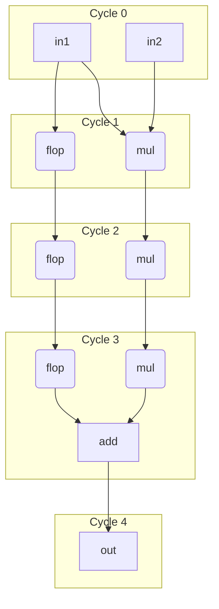

# Pipelining

## Registers and State

In hardware, registers (built from flip-flops) are essential for storing information and creating pipeline stages. Our language provides a clear and safe syntax for managing these stateful elements.

While it's possible to instantiate low-level flops, the recommended, programmer-friendly method is to declare a **register** using the `reg` keyword. This makes statefulness explicit and prevents common bugs. The compiler guarantees that a `reg` is a state-holding element.

A register's value at the start of a cycle is its **current state**. New values are assigned to its **next state** using the `next()` keyword. This clear separation avoids the ambiguity between a register's input (`din`) and output (`q`) pins that plagues many HDLs.

In our syntax, `total@0` refers to the register's current state (its 'q' value). The `next(total)` construct defines the logic for its 'din' pin, which will become the state in the next cycle.

=== "Structural flop style"
    ```
    var counter_next:u8 = _

    let counter_q = __flop(din=next(counter_next)   // defer to get last update
                       ,reset_pin=my_rst, clock_pin=my_clk
                       ,enable=my_enable            // enable control
                       ,posclk=true
                       ,initial=3                   // reset value
                       ,async=false)

    counter_next::[wrap] = counter_q + 1
    ```

=== "Pyrope style"
    ```
    reg counter:u8:[reset_pin=my_rst, clock_pin=my_clk, posclk=true] = 3
    assert counter == counter#[0]  // counter still has the q value

    if my_enable {
      next(counter)::[wrap] = counter + 1
    }
    ```


## Retiming

Registers declared with `reg` are preserved by default, meaning synthesis tools cannot move or optimize them away. This ensures that intentional state is maintained.

If a register is intended to be a flexible pipeline stage rather than a fixed state-holding element, it can be marked with the `retime` attribute. This allows synthesis tools to perform optimizations like moving logic across the register, duplication, or elimination to improve performance.

```
reg my_reg::[retime=true, clock=my_clk, init=0]
```


## Multiply-Add Example

Let's re-examine the example of integrating a 3-cycle multiplier with a 1-cycle adder. The main challenge in most HDLs is that the syntax is not aware of timing, forcing the programmer to manually track and align signals from different pipeline stages. This is error-prone.

Our new syntax solves this with **explicit timing annotations**, making such errors impossible to ignore.


`flow` are like pipe/comb methods but they allow arbitrary mixing of variable
clock cycles. The `flow` blocks mostly connects blocks and variables need
explicit indication of which cycle connect. The `flow` syntax, combined with
`delay` and timing annotations (`var@cycle`), makes the dataflow and its timing
completely explicit. The compiler will enforce that all inputs to a function
are time-aligned. The delay is always relative with the inputs starting point
which assumes all starting at the same block cycle.


```
// Define primitive components with 'pipe'.
pipe mul(a, b) -> (c) { c = a * b }
pipe add(a, b) -> (c) { c = a + b }

// Define the composite flow that orchestrates the primitives.
flow multiply_add(in1, in2) -> (out) {
    // Stage 1: The multiplier takes 3 cycles. Its output is at cycle 3.
    let tmp@3 = delay[3] mul(in1@0, in2@0)

    // Stage 2: To add 'in1' to the result, we must align it with 'tmp@3'.
    // We explicitly delay 'in1' by 3 cycles.
    let in1_d@3 = delay[3] in1@0

    // Stage 3: Now both inputs to 'add' are correctly aligned at cycle 3.
    // The adder takes 1 cycle, so the final output is at cycle 4.
    let out@4 = delay[1] add(tmp@3, in1_d@3)
}
```

This syntax makes the required pipelining of `in1` obvious and enforces it at compile time, preventing bugs caused by mixing values from different cycles.



