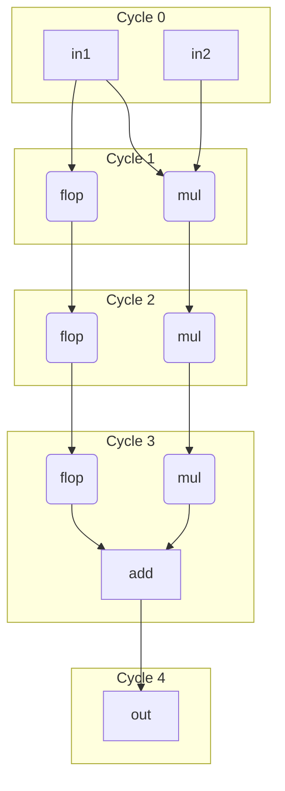

# Pipelining

## Registers and State

In hardware, registers (built from flip-flops) are essential for storing information and creating pipeline stages. Our language provides a clear and safe syntax for managing these stateful elements.

While it's possible to instantiate low-level flops, the recommended, programmer-friendly method is to declare a **register** using the `reg` keyword. This makes statefulness explicit and prevents common bugs. The compiler guarantees that a `reg` is a state-holding element.

A register's value at the start of a cycle is its **current state**. New values are assigned to its **next state** using the `@[]` (defer) syntax. This clear separation avoids the ambiguity between a register's input (`din`) and output (`q`) pins that plagues many HDLs.

In our syntax, `total@[0]` refers to the register's current state (its 'q' value). The `total@[]` construct defers a write to the end of the cycle, defining the logic for its 'din' pin, which will become the state in the next cycle. In debug contexts (e.g., `assert`), `total@[1]` can also be used to read the next cycle value, and for registers `total@[] == total@[1]` always holds.

=== "Structural flop style"
    ```
    mut counter_next:u8:[wrap=true] = ?

    const counter_q = __flop(din=counter_next@[]    // defer to get final update
                       ,reset_pin=ref my_rst, clock_pin=ref my_clk
                       ,enable=my_enable            // enable control
                       ,posclk=true
                       ,initial=3                   // reset value
                       ,async=false)

    counter_next = counter_q + 1
    ```

=== "Pyrope style"
    ```
    reg counter:u8:[wrap=true, reset_pin=ref my_rst, clock_pin=ref my_clk, posclk=true] = 3
    assert counter == counter@[0]  // counter still has the q value
    const tmp1 == counter

    if my_enable {
      counter = counter + 1
    }
    assert tmp1 != tmp2  when my_enable
    assert tmp1 == counter@[0]
    ```


!!! NOTE
    Attributes ending in `_pin` (like `clock_pin`, `reset_pin`) connect wires,
    not values. Use `ref` to indicate a wire connection (e.g., `clock_pin=ref my_clk`).
    The compiler warns if a `_pin` attribute is used without `ref` and without
    a `comptime` value. Passing a `comptime` value like `0` or `false` is valid
    without `ref` (it ties the pin to a constant).

## Retiming

Registers declared with `reg` are preserved by default, meaning synthesis tools cannot move or optimize them away. This ensures that intentional state is maintained.

If a register is intended to be a flexible pipeline stage rather than a fixed state-holding element, it can be marked with the `retime` attribute. This allows synthesis tools to perform optimizations like moving logic across the register, duplication, or elimination to improve performance.

```
reg my_reg::[retime=true, clock=my_clk, init=0]
```


## Multiply-Add Example

Let's re-examine the example of integrating a 3-cycle multiplier with a 1-cycle adder. The main challenge in most HDLs is that the syntax is not aware of timing, forcing the programmer to manually track and align signals from different pipeline stages. This is error-prone.

Our new syntax solves this with **explicit timing annotations**, making such errors impossible to ignore.


`flow` blocks allow arbitrary mixing of variable clock cycles. They have three
complementary timing mechanisms for strong compile-time checking:

* **`delay[N]`** on operations: specifies that an operation takes N cycles.
  `a = delay[N] b` means "a is b delayed by N cycles".

* **`var@[N]`** on variable uses (RHS): specifies which cycle to read the value
  at. The compiler inserts alignment delays if the variable is at an earlier
  cycle, or errors if the alignment is impossible. For example, `in3@[3]`
  delays `in3` from cycle 0 to cycle 3, while `in3@[0]` uses it at its
  original cycle.

* **`:@[N]`** on declarations (LHS): optional timing type check. The compiler
  verifies that the computed cycle matches N. For example,
  `const res:@[5] = delay[2] x@[3]` checks that 3 + 2 = 5.

The `@[N]` annotation with positive N is only valid inside `flow` blocks. It
is not allowed in `comb` (pure combinational), `pipe` (Moore pipeline), or
`mod` (module). Outside `flow`, only `@[0]` (current value), `@[]` (defer to
end of cycle), and `@[-N]` (previous cycles, registers only) are permitted in
non-debug code.

`flow` blocks can also use `reg` for persistent state across cycles, just like
`mod`. This allows a `flow` to both orchestrate pipeline stages with explicit
timing and maintain stateful elements like accumulators or counters.


```
// Define primitive components with 'pipe'.
pipe mul(a, b) -> (c) { c = a * b }
pipe add(a, b) -> (c) { c = a + b }

// Define the composite flow that orchestrates the primitives.
flow multiply_add(in1, in2) -> (out) {
    // Stage 1: The multiplier takes 3 cycles. Its output is at cycle 3.
    const tmp = delay[3] mul(in1@[0], in2@[0])

    // Stage 2: To add 'in1' to the result, we must align it with 'tmp'.
    // We explicitly delay 'in1' by 3 cycles.
    const in1_d = delay[3] in1@[0]

    // Stage 3: Now both inputs to 'add' are correctly aligned at cycle 3.
    // The adder takes 1 cycle, so the final output is at cycle 4.
    const out:@[4] = delay[1] add(tmp@[3], in1_d@[3])
}
```

The three mechanisms catch different classes of bugs:

* `delay[N]` catches wrong operation latency
* `@[N]` on uses catches wrong input alignment
* `:@[N]` on declarations catches wrong output timing

```
flow example(in1, in2, in3) -> (out) {
    const res1 = delay[3] mul(in1@[0], in2@[0])

    // in3@[3]: delay in3 to cycle 3 (same input group as in1, in2)
    const res2a:@[5] = delay[2] res1@[3] + in3@[3]

    // in3@[0]: use in3 at its original cycle (different input group)
    const res2b:@[5] = delay[2] res1@[3] + in3@[0]

    // Compile error: computed cycle is 5, not 4
    // const bad:@[4] = delay[2] res1@[3] + in3@[3]
}
```

This syntax makes the required pipelining obvious and enforces it at compile time, preventing bugs caused by mixing values from different cycles.


```mermaid
graph TD
    subgraph "Cycle 0"
        in1_0[in1]
        in2_0[in2]
    end
    subgraph "Cycle 1"
        m1(mul)
        in1_1(flop)
    end
    subgraph "Cycle 2"
        m2(mul)
        in1_2(flop)
    end
    subgraph "Cycle 3"
        m3(mul) --> a0[add]
        in1_3(flop) --> a0
    end
    subgraph "Cycle 4"
        a0 --> out[out]
    end

    in1_0 --> m1
    in2_0 --> m1
    in1_0 --> in1_1

    m1 --> m2
    in1_1 --> in1_2

    m2 --> m3
    in1_2 --> in1_3
```
